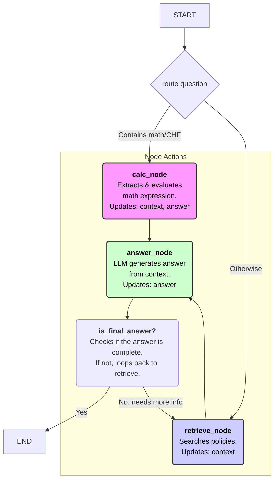

```mermaid
graph TD
    A[START] --> B{route question};
    B -- "Contains math/CHF" --> C[calc_node];
    B -- "Otherwise" --> D[retrieve_node];
    C --> E[answer_node];
    D --> E;
    E --> G{is_final_answer?};
    G -- "Yes" --> F[END];
    G -- "No, needs more info" --> D;

    subgraph "Node Actions"
        style C fill:#f9f,stroke:#333,stroke-width:2px,color:#000
        style D fill:#ccf,stroke:#333,stroke-width:2px,color:#000
        style E fill:#cfc,stroke:#333,stroke-width:2px,color:#000
        C(<b>calc_node</b><br/>Extracts & evaluates<br/>math expression.<br/>Updates: context, answer)
        D(<b>retrieve_node</b><br/>Searches policies.<br/>Updates: context)
        E(<b>answer_node</b><br/>LLM generates answer<br/>from context.<br/>Updates: answer)
        G(<b>is_final_answer?</b><br/>Checks if the answer is complete.<br/>If not, loops back to retrieve.)
    end
```
