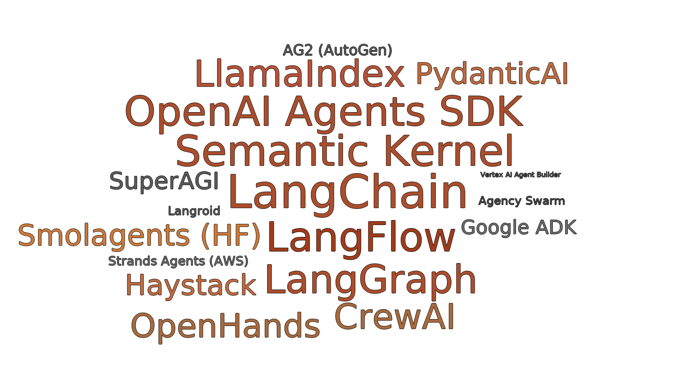
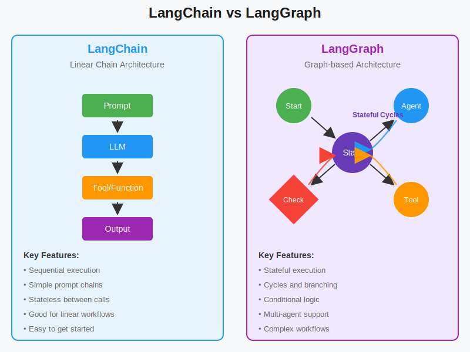
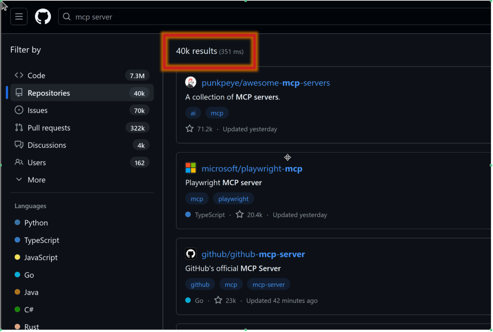
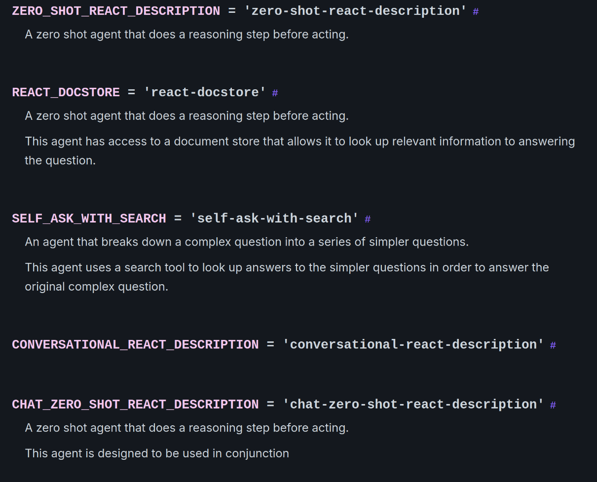
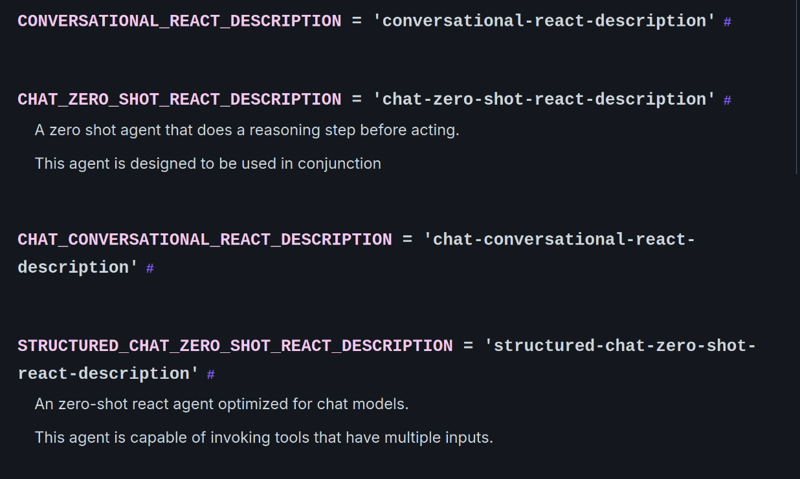
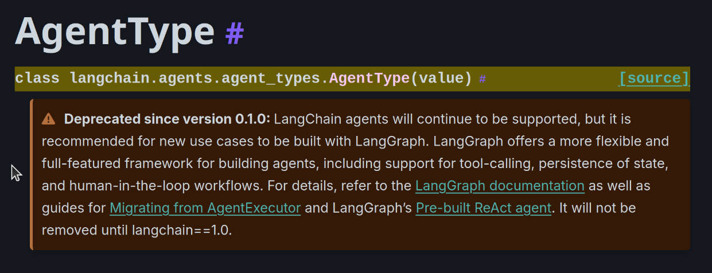
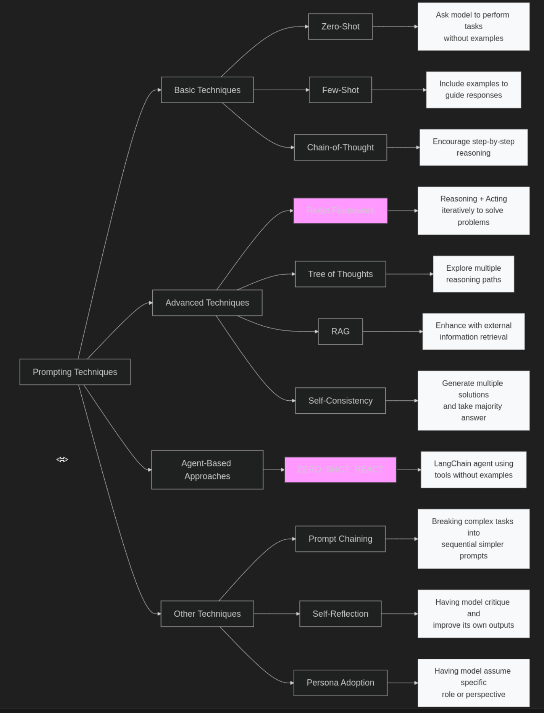
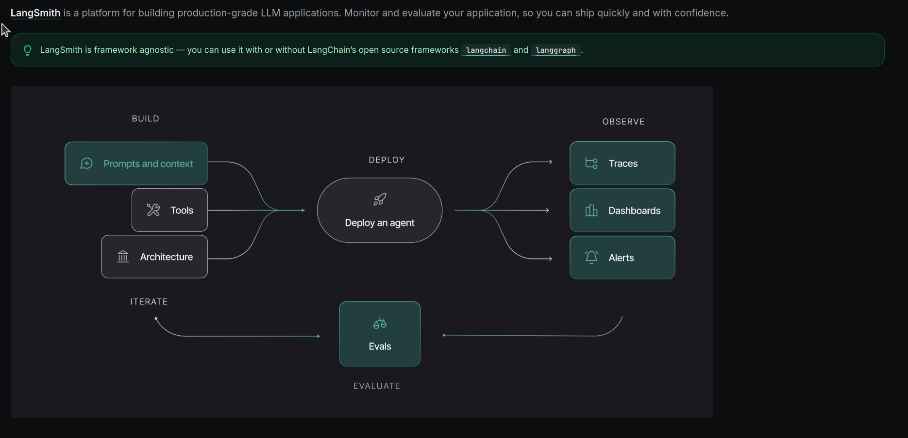

<!-- _class: lead invert -->
<!-- _header: '' -->
<!-- _footer: '' -->

# **AI Agents Unplugged**
## Live, No Magic, No Fuss

**LangChain · LangFlow · MCP (safe\*) · LangGraph**  
*25-minute live tour + code*

**[AI4YOU.SH](https://ai4you.sh)**
**Alessandro S. © 2025**

---
<!-- _header: Agent's Framework -->

---

<!-- _header: Why Agents? -->

## Agents vs. Prompts

**Prompts** are single instructions.  
**Agents** are autonomous workers that can:
- **Plan** a sequence of steps.
- **Use tools** (like code interpreters or APIs).
- **Observe** outcomes and self-correct.
- **Complete** the task.

---

<!-- _header: Agentic Patterns -->

## Common Agent Patterns

- **ReAct**: A simple loop of **Re**asoning and **Act**ing. Great for simple, single-tool tasks.
- **Planner/Executor**: An LLM first creates a multi-step **plan**, then an **executor** carries it out. More robust for complex workflows.
- **Graph / Multi-Agent**: A state machine where nodes are skills and edges are logic. The most flexible and observable pattern.

<!-- 
Notes:
- ReAct: Reason + Act → Observation loop; great for short tasks and few tools. Show a single tool call trace from the notebook. Mention guardrails: step limit and parsing errors.
- Planner/Executor: LLM drafts a plan, executor runs steps, re-plans on failure; better global context but slower. Call out retries, timeouts, and cost tracking.
- Graph / multi‑agent: Nodes = skills; edges = routing; shared state; easy to version, test, and add human‑review. Demo LangGraph g3: route (calc vs retrieve) → answer → human_review (interrupt) → accept/reject loop.
- Trade‑offs: ReAct (simple, fast) vs Planner/Executor (structured, costlier) vs Graph (most control/observability).
- Transition line: “We’ll start with ReAct, then add routing, then close with human‑in‑the‑loop and MCP tools.”
-->

---

<!-- _header: LangChain vs. LangFlow -->

## LangChain vs. LangFlow

| | **LangChain** | **LangFlow** |
|---|---|---|
| **Paradigm** | Code-first (Python/JS) | Visual (Drag & Drop) |
| **Use Case** | Production, testing, CI/CD | Prototyping, collaboration |
| **Core** | LCEL, composable chains | Visual DAGs, REST APIs |
| **Output** | Services, libraries | Exportable JSON flows |

**Key takeaway:** Prototype visually in **LangFlow**, then harden and deploy with **LangChain** for production-grade reliability.

<!-- 
Presenter notes — LangChain vs LangFlow

Definitions
- LangChain (code-first): Python-first framework. LCEL = LangChain Expression Language (composable chains, streaming, retries).
- LangFlow (visual): Drag-and-drop DAG editor for LangChain objects. Export/import JSON. Run flows via REST; can expose endpoints/tools (incl. MCP).

When to choose each
- Use LangChain when you need: 
  - Version control + PR review, unit tests, CI/CD, reproducible builds, fine-grained error handling.
  - Library interop (LangGraph, LangSmith), typed state, and custom tool/security wrappers.
- Use LangFlow when you need:
  - Fast prototyping with non-dev collaborators, quick parameter tuning, and live demos.
  - Visual DAGs that you can export to JSON and call from services via REST.

Deployment paths
- LangChain: package as a service or notebook; containerize; add observability (LangSmith) and evaluations; store prompts and chains in repo.
- LangFlow: self-host or local; secure REST with API keys; export JSON and keep it versioned alongside code; treat environment variables as secrets.

Costs/latency and ops
- Both call the same models/tools; cost is similar. Visual runtime may add a small network hop for REST.
- Keep tool allow-lists, rate limits, and circuit breakers in both.

Interop patterns
- Prototype in LangFlow → export JSON → either invoke via REST or load the exported config into a LangChain service.
- Surface the same tools directly in LangChain and (optionally) via an MCP server for controlled access by multiple agents/clients.

Demo cue
- Flow today: code-first agent → call a LangFlow flow via REST → show MCP tools and controlled access.

Takeaway
- Start visual to align on design, then move stable graphs into code for tests, CI, and hardened security.
-->

---

<!-- _header: LangChain vs. LangGraph -->

---

---

<!-- _header: MCP -->

## MCP (Model-Context-Protocol)

A proposed standard for agents to safely discover and use tools.

- **Goal**: Create a secure "API layer" for LLMs.
- **How**: Agents request a manifest of available tools, get credentials, and then call them.
- **Why**: It enables controlled, observable, and secure agent-to-tool and agent-to-agent communication.

---

<!-- _header: Risks & Guardrails -->

## Risks & Guardrails

| Risk | Mitigation |
|---|---|
| **Prompt Injection** | Input validation, sandboxing |
| **Data Leakage** | Role-based access (RBAC), MCP |
| **Infinite Loops / Cost** | Step limits, circuit breakers |
| **Hallucinations** | Grounding, retrieval augmentation |
| **Tool Abuse** | Rate limiting, audit logs |

---

<!-- _class: invert -->
<!-- _header: Live Demo -->

## **Live Demo**

1.  Build a **ReAct** agent (Retriever + Calculator).
2.  Call a **LangFlow** flow via its REST API.
3.  Secure tool access with **MCP**.

---

---

---

---

---

---

<!-- _class: invert -->
<!-- _header: Closing Thoughts -->

## Closing Thoughts

- Agents are powerful but not "intelligent"—they are stateful, tool-using programs.
- Start simple (**ReAct**) and scale complexity as needed (**Graphs**).
- **Observability** and **guardrails** are not optional.

**Agents are the next layer of abstraction in software.**

---

<!-- _header: Links & Resources -->

## Links & Resources

- **Prompting Guide**: [promptingguide.ai/techniques](https://www.promptingguide.ai/techniques)
- **AI & Anti-Intelligence**: [psychologytoday.com/.../ai-and-the-architecture-of-anti-intelligence](https://www.psychologytoday.com/us/blog/the-digital-self/202507/ai-and-the-architecture-of-anti-intelligence)
- **LangChain**: [langchain.com](https://www.langchain.com/)
- **LangFlow**: [langflow.org](https://langflow.org/)
