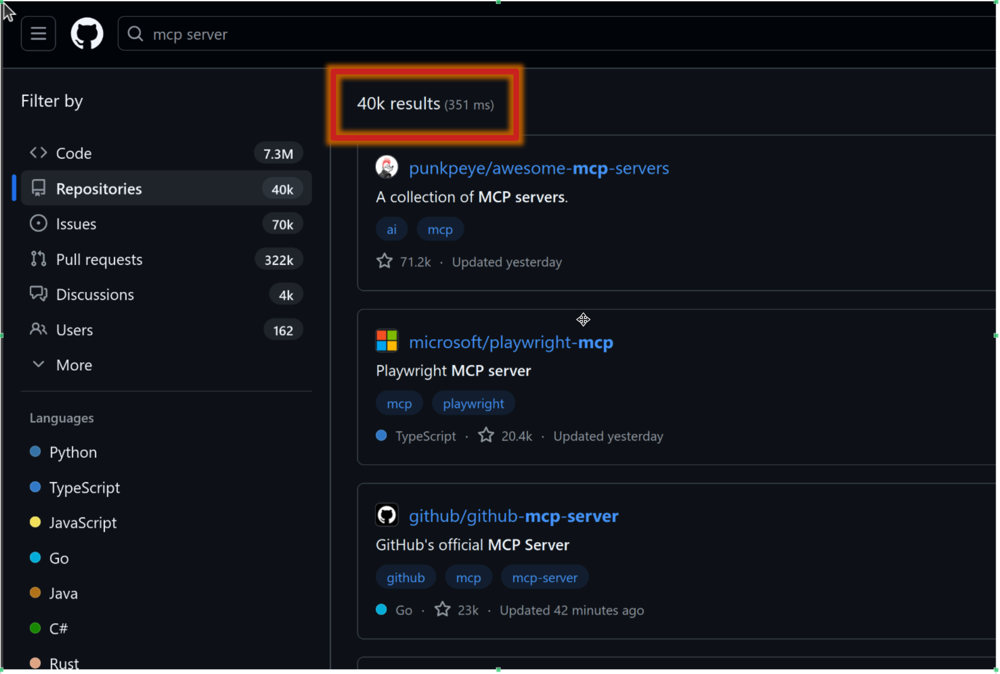
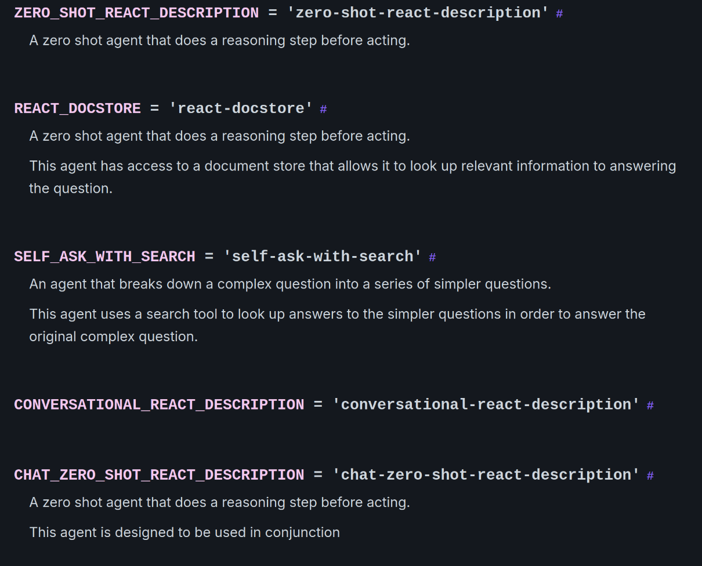
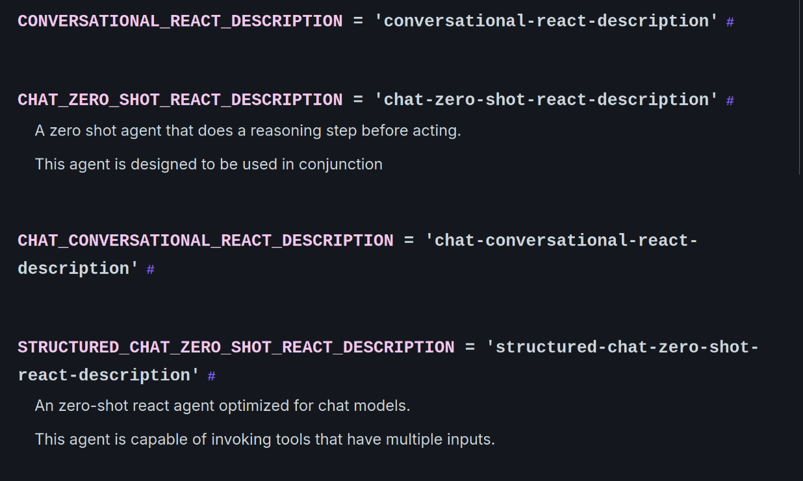
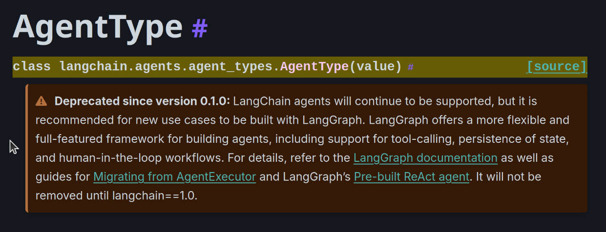
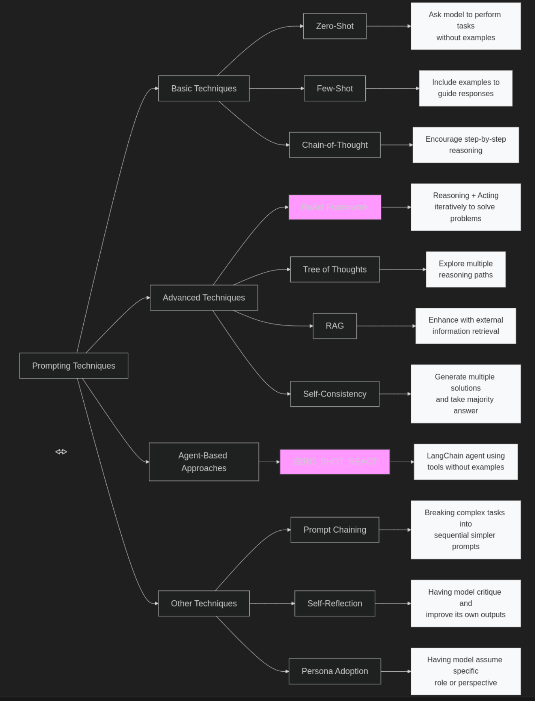
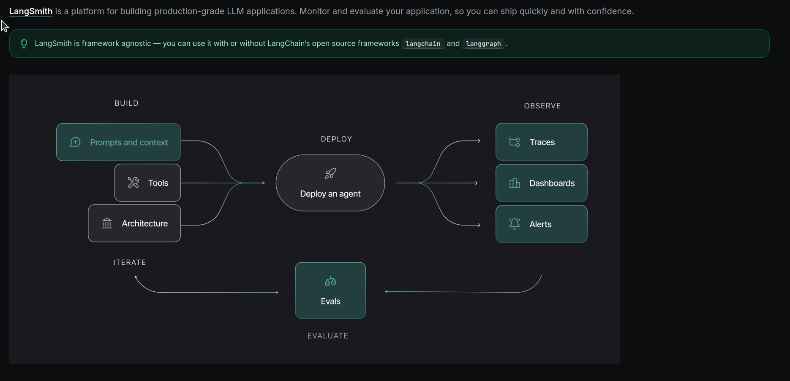

# AI Agents Unplugged: Live, No Magic, No Fuss.

**LangChain · LangFlow · MCP (safe)**  
25-minute live tour + code

CoP Zurich 2025 - Alessandro Surace

---

---

## Why agents (vs prompts)?
**Tools > Prompts.** Agents plan, call tools, verify, and finish tasks.

---

## Patterns
- ReAct — think/act/observe
- Planner/Executor — global plan across steps
- Graph / multi-agent — parallel skills, routing, shared state

<!-- 
Notes:
- ReAct: Reason + Act → Observation loop; great for short tasks and few tools. Show a single tool call trace from the notebook. Mention guardrails: step limit and parsing errors.
- Planner/Executor: LLM drafts a plan, executor runs steps, re-plans on failure; better global context but slower. Call out retries, timeouts, and cost tracking.
- Graph / multi‑agent: Nodes = skills; edges = routing; shared state; easy to version, test, and add human‑review. Demo LangGraph g3: route (calc vs retrieve) → answer → human_review (interrupt) → accept/reject loop.
- Trade‑offs: ReAct (simple, fast) vs Planner/Executor (structured, costlier) vs Graph (most control/observability).
- Transition line: “We’ll start with ReAct, then add routing, then close with human‑in‑the‑loop and MCP tools.”

-->
---

## LangChain vs LangFlow
**LangChain** (code-first): LCEL, tests, CI/CD  
**LangFlow** (visual): DAGs, tweak params, export JSON, REST/MCP endpoints  

<!-- 
Presenter notes — LangChain vs LangFlow

Definitions
- LangChain (code-first): Python-first framework. LCEL = LangChain Expression Language (composable chains, streaming, retries).
- LangFlow (visual): Drag-and-drop DAG editor for LangChain objects. Export/import JSON. Run flows via REST; can expose endpoints/tools (incl. MCP).

When to choose each
- Use LangChain when you need: 
  - Version control + PR review, unit tests, CI/CD, reproducible builds, fine-grained error handling.
  - Library interop (LangGraph, LangSmith), typed state, and custom tool/security wrappers.
- Use LangFlow when you need:
  - Fast prototyping with non-dev collaborators, quick parameter tuning, and live demos.
  - Visual DAGs that you can export to JSON and call from services via REST.

Deployment paths
- LangChain: package as a service or notebook; containerize; add observability (LangSmith) and evaluations; store prompts and chains in repo.
- LangFlow: self-host or local; secure REST with API keys; export JSON and keep it versioned alongside code; treat environment variables as secrets.

Costs/latency and ops
- Both call the same models/tools; cost is similar. Visual runtime may add a small network hop for REST.
- Keep tool allow-lists, rate limits, and circuit breakers in both.

Interop patterns
- Prototype in LangFlow → export JSON → either invoke via REST or load the exported config into a LangChain service.
- Surface the same tools directly in LangChain and (optionally) via an MCP server for controlled access by multiple agents/clients.

Demo cue
- Flow today: code-first agent → call a LangFlow flow via REST → show MCP tools and controlled access.

Takeaway
- Start visual to align on design, then move stable graphs into code for tests, CI, and hardened security.
-->
---

# LangChain vs LangGraph

[LangChain vs LangGraph](./langchain-vs-langgraph.svg)

---

---
## MCP (Model Context Protocol)

It is a standard way to allow LLMs to interact with external tools "in a safe and controlled manner".

It allows automous agents calling and agents to agents communication.

---

## Risks & Guardrails

**Prompt injection** · **PII/secrets leakage** · **Uncontrolled tool access** · **Model hallucinations** · **Cost escalation** · **Infinite loops** · **Cross-agent privilege escalation** · **Training data poisoning** · **Adversarial prompts** · **Resource exhaustion** · **Data exfiltration** · **Supply chain attacks** · **Model drift** · **Observability blind spots** · **Evaluation gaps**

**Mitigations:** MCP sandboxing · Input validation · Rate limiting · Audit logging · Role-based access · Circuit breakers

---

## Live Demo
1) Build **ReAct** agent (retriever + calculator)  
2) Call **LangFlow** flow via REST  
3) Attach **MCP** safe tools

---

---

---

---

# [Prompt Techniques](image-4.png)

---

# LangSmith

---

## Closing
Agents are **tools-first** systems. Ship-ready means versioned graphs, safe tools (MCP), and evaluation & observability.

---

## Links

https://www.promptingguide.ai/techniques
