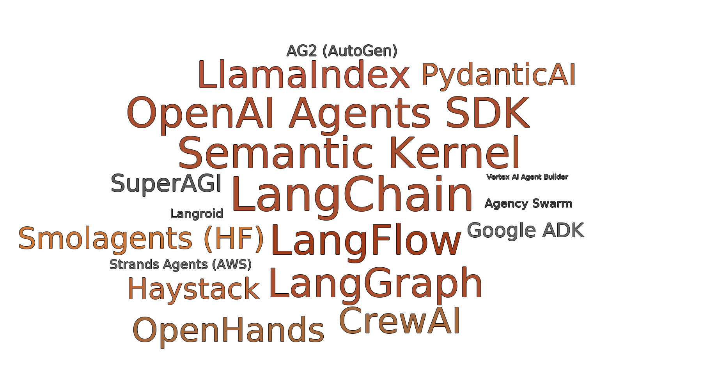
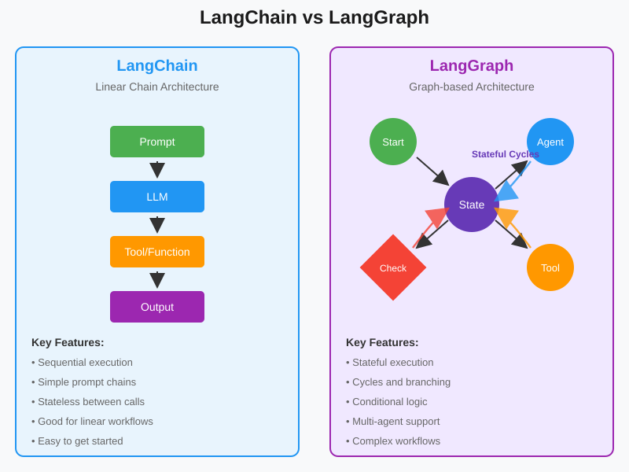
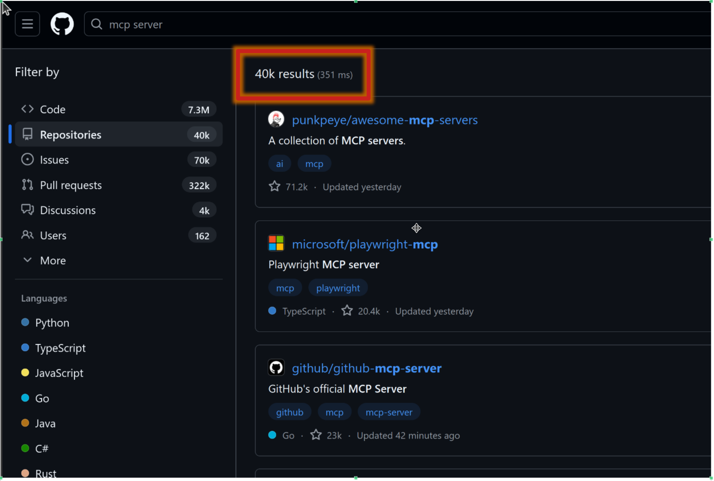
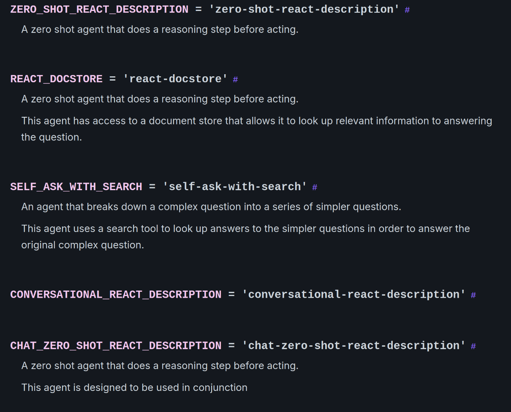
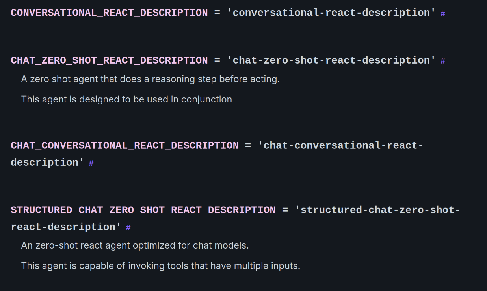
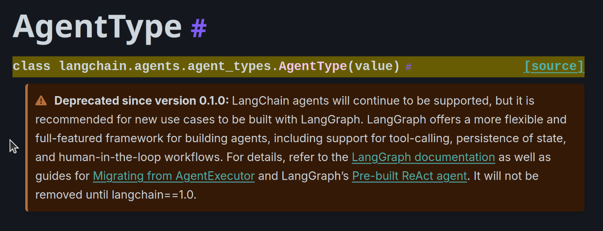
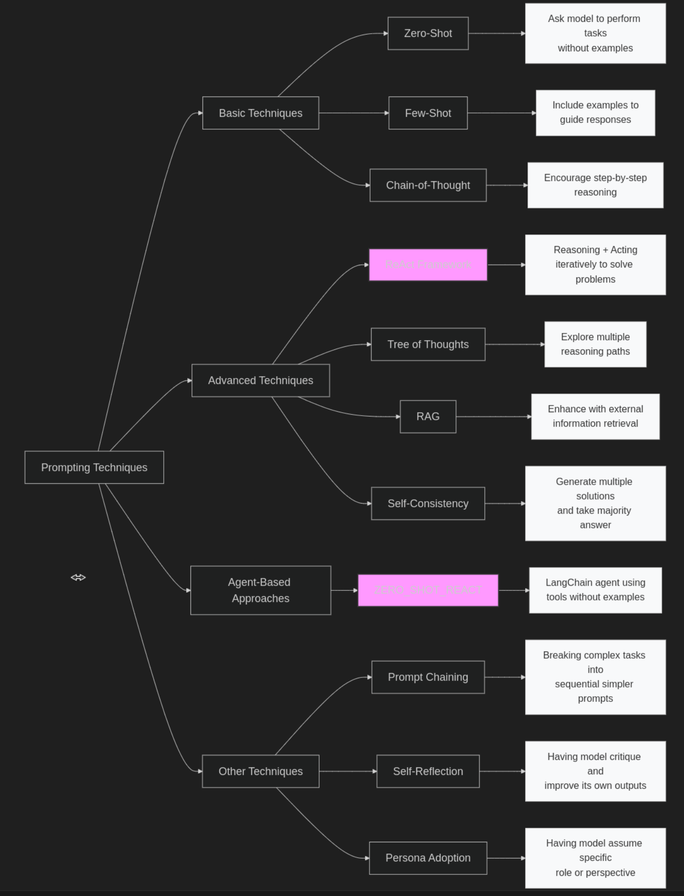
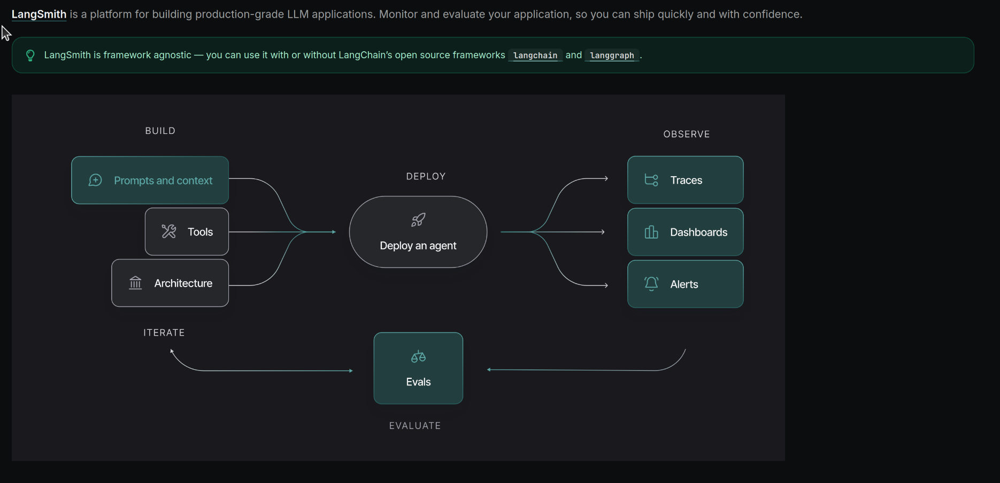

<!-- _class: lead invert -->
<!-- _header: '' -->
<!-- _footer: '' -->
<!-- python -m http.server 8080 -->

# **AI Agents Unplugged**
## Live, No Magic, No Fuss

**LangChain · LangFlow · MCP (safe\*) · LangGraph**  
*25-minute live tour + code*

**[AI4YOU.SH](https://ai4you.sh)**
**Alessandro S. © 2025/2026**

<!-- Speaker Notes

cd /workspaces/docker-volume/Agents_unplugged_for_real_no_magic_no_fuss/presentation
python -m http.server 8080
- Hi everyone — welcome. “Unplugged” means practical and no hype.
- In the next 25 minutes, we’ll move from simple prompts to reliable, observable agent workflows.
- Stick around for a short demo and a clear path you can replicate.
 -->

---
<!-- _header: Agent's Framework -->



<!-- Speaker Notes
- This word cloud shows just how many agent frameworks exist today.
- Different names, similar goals: build useful, reliable agent workflows.
- Today’s path: prototype quickly, then harden for production.
 -->

---

<!-- _header: Why Agents? -->

## Agents vs. Prompts

**Prompts** are single instructions.

**Agents** are autonomous workers that can:

- **Plan** a sequence of steps.
- **Use tools** (like code interpreters or APIs).
- **Observe** outcomes and self-correct.
- **Complete** the task.

<!-- Speaker Notes
- Prompts are single-shot instructions. Agents are stateful workers that plan, act with tools, observe, and finish.
- We’ll look at tool-calling, retries, and shared state — the ingredients of a reliable agent.
 -->

---

<!-- _header: Agentic Patterns -->

## Common Agent Patterns

- **ReAct**: A simple loop of **Re**asoning and **Act**ing. Great for simple, single-tool tasks.
- **Planner/Executor**: An LLM first creates a multi-step **plan**, then an **executor** carries it out. More robust for complex workflows.
- **Graph / Multi-Agent**: A state machine where nodes are skills and edges are logic. The most flexible and observable pattern.

<!-- Speaker Notes 
- We’ll climb a simple ladder of patterns: ReAct → Planner/Executor → Graph.
- ReAct is fast; add step limits and parsing checks. Planner/Executor adds structure and retries. Graphs add control and observability.
- We’ll start simple and escalate, ending with human-in-the-loop and MCP.

Notes:
- ReAct: Reason + Act → Observation loop; great for short tasks and few tools. Show a single tool call trace from the notebook. Mention guardrails: step limit and parsing errors.
- Planner/Executor: LLM drafts a plan, executor runs steps, re-plans on failure; better global context but slower. Call out retries, timeouts, and cost tracking.
- Graph / multi‑agent: Nodes = skills; edges = routing; shared state; easy to version, test, and add human‑review. Demo LangGraph g3: route (calc vs retrieve) → answer → human_review (interrupt) → accept/reject loop.
- Trade‑offs: ReAct (simple, fast) vs Planner/Executor (structured, costlier) vs Graph (most control/observability).
- Transition line: “We’ll start with ReAct, then add routing, then close with human‑in‑the‑loop and MCP tools.”
-->

---

<!-- _header: LangChain vs. LangFlow -->

## LangChain vs. LangFlow

| | **LangChain** | **LangFlow** |
|---|---|---|
| **Paradigm** | Code-first (Python/JS) | Visual (Drag & Drop) |
| **Use Case** | Production, CI/CD, testing | Prototyping → Production |
| **Core** | Agents (on LangGraph), LCEL | Visual flows, REST/MCP APIs |
| **Output** | Services, libraries | APIs, JSON flows |

**Key takeaway:** Prototype visually in **LangFlow**, then harden and deploy with **LangChain** for production-grade reliability.

<!-- Speaker Notes
- Prototype visually in LangFlow, then ship with LangChain.
- Export JSON and call it via REST or load it directly in code.
- Operational guardrails in both: allow-lists, rate limits, circuit breakers.

Presenter notes — LangChain vs LangFlow

Definitions
- LangChain (code-first): Python-first framework. Core abstraction is now **agents built on LangGraph** (durable execution, human-in-the-loop, persistence). LCEL still available for composable chains/streaming.
  - Deep Agents: "batteries-included" agents with automatic context compression, virtual filesystem, and subagent-spawning.
- LangFlow (visual): Open-source, Python-based visual editor for AI apps. Drag-and-drop flows, export/import JSON. Run flows via REST; native MCP server/client support.

When to choose each
- Use LangChain when you need: 
  - Version control + PR review, unit tests, CI/CD, reproducible builds, fine-grained error handling.
  - Library interop (LangGraph, LangSmith, Deep Agents), typed state, and custom tool/security wrappers.
  - Full control over agent orchestration and low-level customization.
- Use LangFlow when you need:
  - Fast prototyping with non-dev collaborators, quick parameter tuning, and live demos.
  - Visual DAGs that you can export to JSON and call from services via REST or MCP.
  - Production deployment via enterprise cloud or self-hosted (LangFlow now supports full prod path).

Deployment paths
- LangChain: package as a service or notebook; containerize; add observability (LangSmith) and evaluations; store prompts and chains in repo.
- LangFlow: self-host, local, or enterprise cloud; secure REST/MCP with API keys; export JSON and keep it versioned alongside code; treat environment variables as secrets.

Costs/latency and ops
- Both call the same models/tools; cost is similar. Visual runtime may add a small network hop for REST.
- Keep tool allow-lists, rate limits, and circuit breakers in both.

Interop patterns
- Prototype in LangFlow → export JSON → either invoke via REST or load the exported config into a LangChain service.
- Use LangFlow as an MCP server to expose flows as tools for other agents/clients.
- Surface the same tools directly in LangChain and (optionally) via an MCP server for controlled access by multiple agents/clients.

Demo cue
- Flow today: code-first agent → call a LangFlow flow via REST → show MCP tools and controlled access.

Takeaway
- Both now support prototyping → production. Start visual to align on design, then move stable graphs into code for tests, CI, and hardened security—or deploy directly from LangFlow cloud.
-->

---
<!-- _header: Where Does LangGraph Fit? -->

## The LangChain Ecosystem

🎨 **LangFlow** — Visual prototyping & REST APIs
      ↓
🔗 **LangChain** — Code-first orchestration
      ↓
📊 **LangGraph** — Stateful graphs & agents
      ↓
🔍 **LangSmith** — Observability & evaluation

---

<!-- _header: Linear Chains vs. Stateful Graphs -->




<!-- 
Presenter notes — LangChain vs LangGraph

The Diagram
- LEFT (LangChain): Shows a linear chain architecture: Prompt → LLM → Tool/Function → Output. 
  Sequential, stateless between calls—great for simple, one-shot workflows.
- RIGHT (LangGraph): Shows a graph-based architecture with a central **State** node connected to Start, Agent, Tool, and Check (decision) nodes.
  Notice the **return arrows**—nodes read and write back to shared state, enabling cycles and iterative refinement.

Key Differences
- LangChain (linear): 
  - Sequential execution, simple prompt chains.
  - Stateless between calls—each invocation is independent.
  - Easy to get started; good for straightforward pipelines (RAG, summarization, Q&A).
- LangGraph (graph):
  - Stateful execution—state persists across steps and even across sessions.
  - Supports **cycles** (loops), **branching**, and **conditional logic** (the diamond "Check" node).
  - Multi-agent orchestration: route between different agent skills or handoff to human review.
  - Built-in support for **durable execution**, **human-in-the-loop**, and **persistence** (checkpointing).

When to use each
- Use LangChain when: simple linear workflows, quick prototypes, or when LangGraph's complexity isn't needed.
- Use LangGraph when: you need loops (ReAct-style reasoning), conditional routing, multi-agent coordination, human approval gates, or long-running durable tasks.

Important: LangChain agents are now built ON TOP of LangGraph
- You don't need to learn LangGraph for basic agent usage—LangChain's `create_agent()` abstracts it.
- But if you need fine-grained control, you drop down to LangGraph directly.

Transition line
- "So LangGraph gives us the control we need for complex workflows. Next, let's talk about how agents discover and use tools securely—that's where MCP comes in."
-->

---

<!-- _header: MCP -->

## MCP (Model-Context-Protocol)

A proposed standard for agents to safely discover and use tools.

- **Goal**: Create a *"secure"* API layer for LLMs.
- **How**: Agents request a manifest of available tools, get credentials, and then call them.
- **Why**: It enables controlled, observable, and *"secure"* agent-to-tool and agent-to-agent communication.

<!-- Speaker Notes 
- MCP is the safe handshake: an agent asks for a manifest, gets scoped credentials, and calls tools with auditability.
- Think of this as API governance for LLMs — controlled, observable access to tools and even other agents.
- I’ll highlight where MCP fits into the demo flow.
 -->

---

<!-- _header: MCP -->



<!-- Speaker Notes
- The number of MCP servers is growing fast — great momentum. 3 months ago 40K, today 67.1K results on GitHub.
- Quality varies, so use trusted servers, scoped credentials, and strict allow-lists.
- Aim for speed with safety, not unchecked access.
 -->

---

<!-- _header: Risks & Guardrails -->

## Risks & Guardrails

| Risk | Mitigation |
|---|---|
| **Prompt Injection** | Input validation, sandboxing |
| **Data Leakage** | Role-based access (RBAC), MCP |
| **Infinite Loops / Cost** | Step limits, circuit breakers |
| **Hallucinations** | Grounding, retrieval augmentation |
| **Tool Abuse** | Rate limiting, audit logs |

<!-- Speaker Notes 
- Here are the top risks and what we do about them.
- Prompt injection: sanitize inputs and sandbox tools. Data leakage: use RBAC and scoped MCP credentials.
- Infinite loops and cost: add step limits and circuit breakers. Hallucinations: ground answers with retrieval.
- Tool abuse: enforce rate limits and keep audit logs.
 -->

---

<!-- _class: invert -->
<!-- _header: Live Demo -->

## **Live Demo**

1. Build a **ReAct** agent (Retriever + Calculator).
2. Call a **LangFlow** flow via its REST API.
3. Secure tool access with **MCP**.
4. **LangGraph**: route between skills, add human review, and observe traces.

```bash
./notebooks/start_miniconda_env.sh
```

<!-- Speaker Notes 
- Three beats to watch: first, a ReAct agent that retrieves and calculates; second, a hand-off to a LangFlow REST flow; third, tools accessed with MCP.
- I’ll narrate decisions, retries, and guardrails, pausing briefly so you can see traces.
- By the end, you’ll see a complete path from idea to controlled execution.
 -->

---



<!-- Speaker Notes 
- Common prompting techniques: zero-shot, few-shot, chain-of-thought, ReAct, tree-of-thoughts, RAG, self-consistency, prompt chaining, self-reflection, and persona.
- For the demo, we’ll lean on ReAct and RAG — simple, effective, and observable.
- Keep these labels in mind; they help name patterns when we review traces.
 -->

---



<!-- Speaker Notes 
- Agent-based approaches structure the model’s thinking into clear steps and tool calls.
- This reduces variance, increases reliability, and makes testing and debugging easier.
- Prefer small, explicit steps over giant, fragile prompts.
 -->

---



<!-- Speaker Notes 
- LangChain’s `AgentType` is deprecated for new scenarios; the recommended path is LangGraph.
- Graphs offer better tool-calling, persistent state, and human-in-the-loop support.
- We start simple, then align to graphs as we add control.
 -->
---



<!-- Speaker Notes 
- Prompt engineering still matters, but structure wins.
- Use concise prompts plus explicit steps, tools, and testable graphs rather than oversized prompts.
- This keeps systems easier to maintain and reason about.
 -->

---



<!-- Speaker Notes 
- Agent lifecycle: build, deploy, observe, evaluate, and iterate.
- Traces and dashboards give visibility; alerts keep production healthy.
- Evals help catch regressions early.
 -->

---

<!-- _class: invert -->
<!-- _header: Closing Thoughts -->

## Closing Thoughts

- Agents are powerful but not "intelligent"—they are stateful, tool-using programs.
- Start simple (**ReAct**) and scale complexity as needed (**Graphs**).
- **Observability** and **guardrails** are not optional.

**Agents are the next layer of abstraction in software.**

<!-- Speaker Notes 
- Agents are stateful, tool-using programs — not magic.
- Start small with ReAct, move to graphs when you need control and observability.
- This turns LLMs into dependable software.
 -->

---

<!-- _header: Links & Resources -->

## Links & Resources

- **Prompting Guide**: [promptingguide.ai/techniques](https://www.promptingguide.ai/techniques)
- **AI & Anti-Intelligence**: [psychologytoday.com/.../ai-and-the-architecture-of-anti-intelligence](https://www.psychologytoday.com/us/blog/the-digital-self/202507/ai-and-the-architecture-of-anti-intelligence)
- **LangChain**: [langchain.com](https://www.langchain.com/)
- **LangFlow**: [langflow.org](https://langflow.org/)

<!-- Speaker Notes
- Next steps: the Prompting Guide covers techniques; the “anti-intelligence” article gives broader context.
- Build with LangChain and LangFlow; add LangGraph docs and MCP server lists to your reading.
- Links included so you can explore further.
 -->
