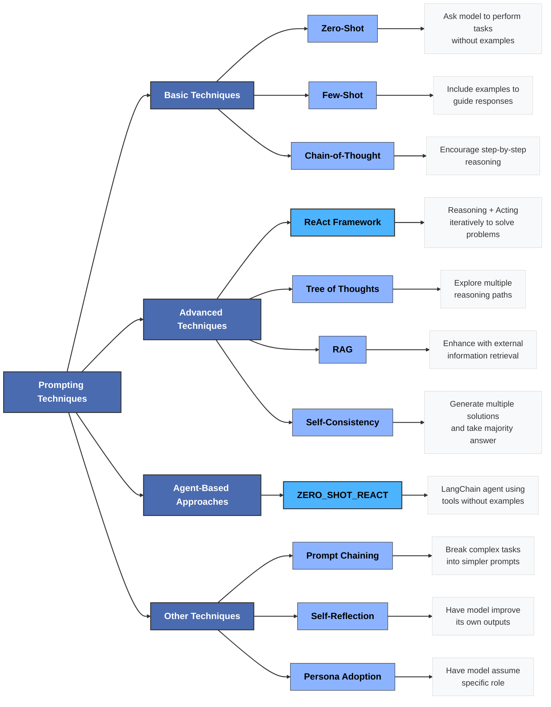

```mermaid
flowchart LR
    %% Using flowchart with left-to-right direction for better spacing
    classDef default font-size:20px
    classDef categoryClass fill:#4a6baf,color:white,stroke:#333,stroke-width:2px,font-weight:bold
    classDef techniqueClass fill:#8cb3ff,stroke:#333,color:#000,stroke-width:1px,font-weight:bold
    classDef descriptionClass fill:#f8f9fa,stroke:#ddd,color:#333,font-size:18px,font-weight:normal
    classDef highlightClass fill:#4cb3ff,stroke:#333,color:#000,stroke-width:2px,font-weight:bold
    
    A[Prompting Techniques] --> B[Basic Techniques]
    A --> C[Advanced Techniques]
    A --> D[Agent-Based Approaches]
    A --> E[Other Techniques]
    
    B --> B1[Zero-Shot]
    B1 --> B1desc[Ask model to perform tasks<br>without examples]
    
    B --> B2[Few-Shot]
    B2 --> B2desc[Include examples to<br>guide responses]
    
    B --> B3[Chain-of-Thought]
    B3 --> B3desc[Encourage step-by-step<br>reasoning]
    
    C --> C1[ReAct Framework]
    C1 --> C1desc[Reasoning + Acting<br>iteratively to solve problems]
    
    C --> C2[Tree of Thoughts]
    C2 --> C2desc[Explore multiple<br>reasoning paths]
    
    C --> C3[RAG]
    C3 --> C3desc[Enhance with external<br>information retrieval]
    
    C --> C4[Self-Consistency]
    C4 --> C4desc[Generate multiple solutions<br>and take majority answer]
    
    D --> D1[ZERO_SHOT_REACT]
    D1 --> D1desc[LangChain agent using<br>tools without examples]
    
    E --> E1[Prompt Chaining]
    E1 --> E1desc[Break complex tasks<br>into simpler prompts]
    
    E --> E2[Self-Reflection]
    E2 --> E2desc[Have model improve<br>its own outputs]
    
    E --> E3[Persona Adoption]
    E3 --> E3desc[Have model assume<br>specific role]
    
    class A,B,C,D,E categoryClass
    class B1,B2,B3,C2,C3,C4,E1,E2,E3 techniqueClass
    class B1desc,B2desc,B3desc,C1desc,C2desc,C3desc,C4desc,D1desc,E1desc,E2desc,E3desc descriptionClass
    class C1,D1 highlightClass
    
    %% Add more spacing between nodes
    linkStyle default stroke-width:2px
```

https://www.promptingguide.ai/techniques